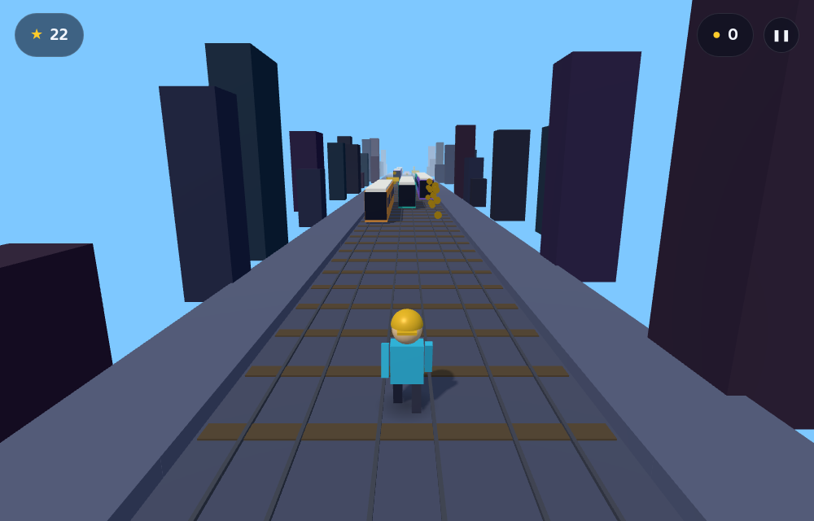

# Subway Runner

A Subway Surfers–style 3D endless runner built with [Three.js](https://threejs.org/) and [Vite](https://vitejs.dev/). Run forever down a three‑lane track, dodge oncoming trains and barriers, slide under gates, leap over crates, and scoop up coins while the pace keeps ramping up.



## Gameplay

- **Endless track** – the world is generated procedurally and scrolls toward you forever.
- **Three lanes** – switch lanes to dodge obstacles.
- **Obstacles**
  - **Trains** – tall; you must switch lanes to avoid them. Run into one and you bounce off it (with a camera shake) before the game ends.
  - **Barriers** (red) – jump over them.
  - **Gates** (yellow bar) – roll/slide under them.
  - **Crates** (grey) – jump over them.
- **Coins** – grab coins (sometimes in arcs over jumps) to boost your coin count.
- **Speed ramp** – you accelerate the longer you survive.
- **Scoring** – score grows with distance; your best score is saved in `localStorage`.

## Controls

| Action | Keyboard | Touch |
| ------ | -------- | ----- |
| Move left | `←` / `A` | swipe left |
| Move right | `→` / `D` | swipe right |
| Jump | `↑` / `W` / `Space` | swipe up |
| Roll / slide | `↓` / `S` | swipe down |
| Pause | `Esc` / `P` | pause button |

## Getting started

Requires Node.js 18+.

```bash
npm install      # install dependencies
npm run dev      # start the dev server (http://localhost:5173)
```

To create and preview a production build:

```bash
npm run build    # output to dist/
npm run preview  # serve the production build
```

## Project structure

```
index.html        # markup for the canvas, HUD and menus
src/
  main.js         # entry point – boots the game and wires up UI buttons
  game.js         # renderer, scene, camera, lights, game loop, collisions, state
  world.js        # procedural track, obstacles, coins and scenery (with object pooling)
  player.js       # the runner character, animations, jump/roll/lane logic
  input.js        # unified keyboard + touch-swipe input
  ui.js           # HUD and overlay (menu / pause / game over) management
  config.js       # all gameplay tuning constants and the color palette
  styles.css      # UI styling
smoke-test.mjs    # optional headless browser smoke test (see below)
```

## Tuning

Almost every gameplay value (speed, gravity, jump height, lane width, spawn density,
colors, camera placement, …) lives in [`src/config.js`](src/config.js) so the game is
easy to rebalance without touching the engine code.

## Optional: headless smoke test

`smoke-test.mjs` boots the built game in a headless browser, simulates input, and checks
that it renders and runs without console errors. It needs Puppeteer, which is not a
project dependency:

```bash
npm install -D puppeteer
npm run build
npm run preview &        # serve on :4173
URL=http://localhost:4173/ node smoke-test.mjs
```

## License

MIT
